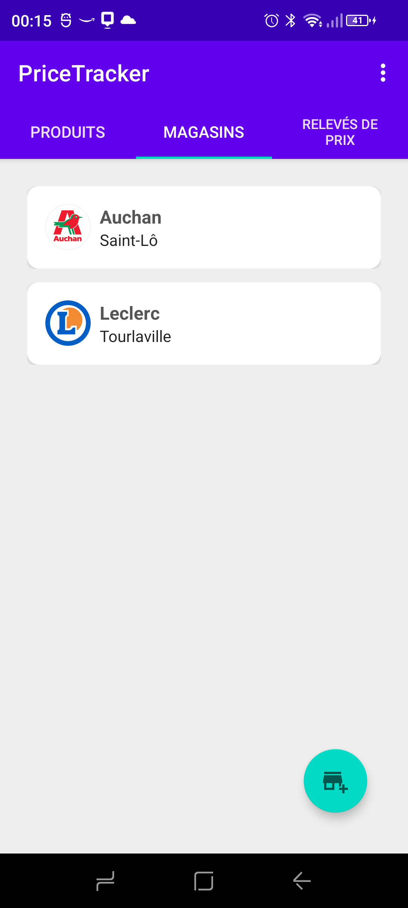
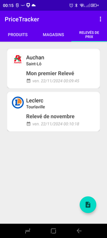
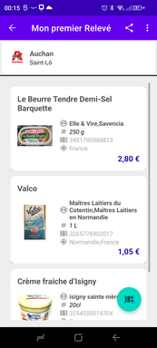

# PriceTracker

PriceTracker est une application permettant d'effectuer des relevés de prix dans des magasins par un scan de code-barres. Les relevés de prix peuvent être partagés ou exportés au format CSV.

L'application sera bientôt disponible depuis le Google Play Store. En attendant, vous pouvez l'installer sur votre smartphone android en exécutant le fichier [PriceTracker_v0.3.apk](https://github.com/Farvil/PriceTracker/releases/download/v0.3/PriceTracker_v0.3.apk) disponible sur [la page de la dernière release](https://github.com/Farvil/PriceTracker/releases/tag/v0.3)

## Captures d'écran

## Fonctionnalités

L'onglet ***PRODUITS*** permet de visualiser les produits déjà enregistrés et d'en ajouter de nouveaux en scannant un code-barre. Les données sont récupérées depuis le site OpenFoodFacts. Un clic court sur un produit permet de visualiser les relevés de prix associés et de les comparer ainsi que d'accéder directement au site OpenFoodFacts pour plus de détails. Un clic long permet d'entrer dans le mode de sélection pour supprimer des produits.

L'onglet ***MAGASINS*** permet de visualiser les magasins enregistrés et d'en créer. Un clic court sur un magasin permet de visualiser les relevés associés à ce magasin. Un clic long permet d'entrer dans le mode de sélection pour modifier un magasin ou en supprimer.

L'onglet ***RELEVES DE PRIX*** permet de visualiser et créer des relevés de prix pour un magasin donné. Un clic court affiche le relevé et un clic long permet la modification, la suppression, l'export ou le partage des relevés. Les relevés sont exportés au format CSV.

L'écran du ***détail d'un relevé de prix*** permet d'afficher et modifier les prix de produits. Il est possible d'ajouter un produit de la bibliothèque par le menu ou par un scan de code barre. Le scan permet également de créer un nouveau produit si celui-ci n'existe pas. Il est possible de faire un export ou un partage au format CSV depuis cet écran.

Pour visualiser un fichier CSV, vous pouvez utiliser par exemple l'application ***"Microsoft Excel: Spreadsheets"***.

## Licence

PriceTracker est une application open source sous licence [GPL version 3](LICENSE). Cela signifie que vous êtes libre de télécharger, utiliser et modifier le code source de l'application, sous réserve de respecter les termes de la licence.
