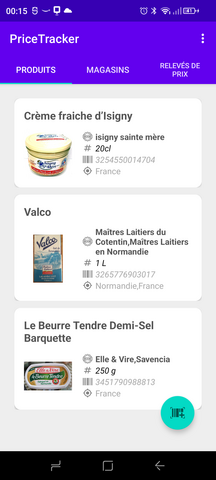
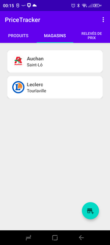

# PriceTracker

PriceTracker est une application permettant d'effectuer des relevés de prix dans des magasins par un scan de code-barres. Les relevés de prix peuvent être partagés ou exportés au format CSV.

L'application sera bientôt disponible depuis le Google Play Store. En attendant, vous pouvez l'installer sur votre smartphone android en exécutant le fichier [PriceTracker_v0.3.apk](https://github.com/Farvil/PriceTracker/releases/download/v0.3/PriceTracker_v0.3.apk) disponible sur [la page de la dernière release](https://github.com/Farvil/PriceTracker/releases/tag/v0.3)

Voici quelques captures d'écran de l'application : 

